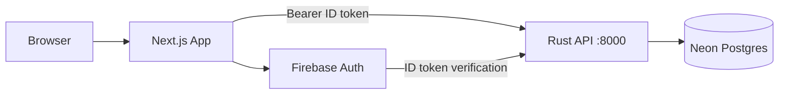
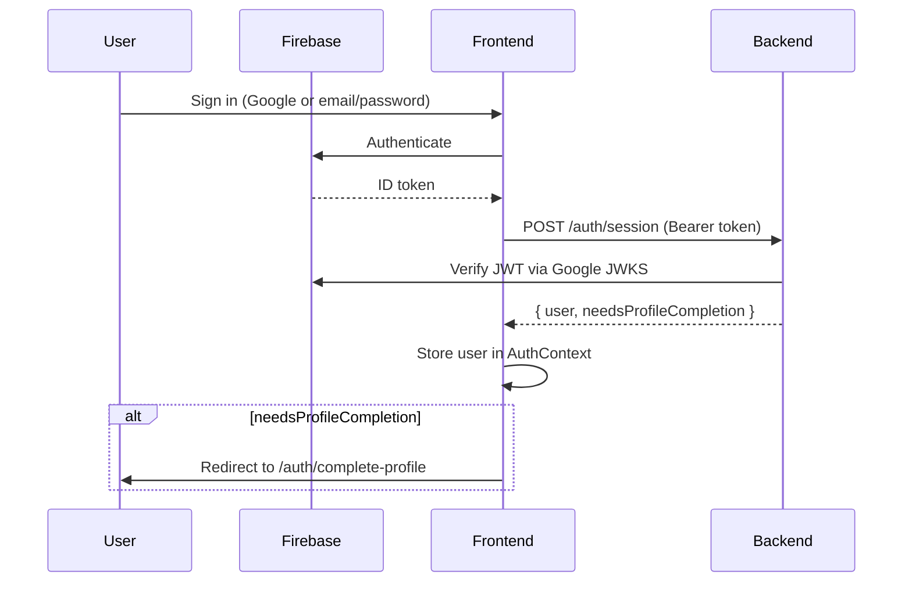

# UJ AI Club — Frontend

The public-facing web application for the **University of Jordan AI Club**. Built with Next.js, it provides the landing page, learning resources, weekly challenges, leaderboards, member profiles, and an admin dashboard — all backed by the [Rust/Axum API](../uj-ai-club-backend/README.md) and **Firebase Authentication**.

**Production:** [uj-aiclub.com](https://uj-aiclub.com) · **API:** [api.uj-aiclub.com](https://api.uj-aiclub.com)

---

## Table of Contents

- [Overview](#overview)
- [Tech Stack](#tech-stack)
- [Architecture](#architecture)
- [Project Structure](#project-structure)
- [Prerequisites](#prerequisites)
- [Installation](#installation)
- [Environment Variables](#environment-variables)
- [Running Locally](#running-locally)
- [Building for Production](#building-for-production)
- [Routes](#routes)
- [Authentication Flow](#authentication-flow)
- [API Client Layer](#api-client-layer)
- [Styling](#styling)
- [SEO & Metadata](#seo--metadata)
- [Deployment](#deployment)
- [Troubleshooting](#troubleshooting)
- [Related Repos](#related-repos)

---

## Overview

This frontend is a **Next.js 16 App Router** application that serves as the primary interface for club members and visitors. It handles:

- **Public pages** — landing, roadmap, resources, certificates, contact form
- **Member features** — weekly AI challenges, profile settings, leaderboards
- **Admin panel** — CRUD for resources, certificates, challenges, notebooks, submissions, and contact messages
- **Auth** — Firebase (Google sign-in + email/password) with backend session sync

All authenticated API calls send a Firebase ID token to the backend, which verifies it and resolves the user record in PostgreSQL.

---

## Tech Stack

| Layer | Technology |
|-------|------------|
| Framework | [Next.js 16](https://nextjs.org/) (App Router) |
| UI | React 19 |
| Language | JavaScript (no TypeScript) |
| Auth | [Firebase Auth](https://firebase.google.com/docs/auth) |
| HTTP client | Native `fetch` via `lib/api.js` |
| Icons | Lucide React, Heroicons |
| Notebook demo | CodeMirror + Pyodide (in-browser Python) |
| 3D / visuals | Three.js, custom SVG |
| CSS | Custom design system (`app/uoj-styles.css`) |
| Package manager | **npm** |

Tailwind CSS v4 is installed but used minimally — the main UI relies on the custom CSS design system.

---

## Architecture



**Request flow (authenticated):**

1. User signs in via Firebase (Google or email/password).
2. `AuthContext` listens for token changes and calls `POST /auth/session` on the backend.
3. Backend returns the user record and `needsProfileCompletion` flag.
4. All subsequent API calls attach `Authorization: Bearer <firebase_id_token>`.
5. On `401`, the client signs out and redirects to `/login`.

---

## Project Structure

```
uj-ai-club-frontend/
├── app/                          # Next.js App Router
│   ├── layout.js                 # Root layout (fonts, AuthProvider, AppShell)
│   ├── page.js                   # Landing page
│   ├── uoj-styles.css            # Primary design system
│   ├── globals.css               # Tailwind import (not actively used by layout)
│   ├── admin/                    # Admin dashboard & submission grading
│   ├── auth/complete-profile/    # Profile completion after first sign-in
│   ├── challanges/               # Weekly challenges (note: route spelling)
│   ├── certificates/[id]/        # Public certificate detail pages
│   ├── login/                    # Email/password + Google sign-in
│   ├── signup/                   # Google-only registration
│   ├── notebook-demo/            # In-browser Python notebook demo
│   ├── resources/                # Learning resources (list + detail)
│   ├── roadmap/                  # Static AI learning roadmap
│   ├── settings/                 # User profile & avatar settings
│   ├── components/               # Page-specific components
│   │   └── uoj/                  # App shell, navbar, footer, hero SVG
│   ├── sitemap.js                # Dynamic sitemap (fetches from API)
│   └── robots.js                 # SEO robots rules
├── components/                   # Shared components
│   ├── JsonLd.js                 # Structured data for SEO
│   └── ProtectedRoute.js         # Client-side route guard
├── contexts/
│   └── AuthContext.js            # Global auth state & session sync
├── lib/
│   ├── api.js                    # Client-side API layer (primary)
│   ├── server-api.js             # Server-side public fetches (SEO/metadata)
│   ├── firebase.js               # Firebase app & auth initialization
│   ├── googleSignIn.js           # Google sign-in (popup + redirect fallback)
│   ├── metadata.js               # Shared metadata helpers
│   ├── site.js                   # Site URL constants
│   └── profileOptions.js         # University/major dropdown options
├── public/                       # Static assets
├── .env.example                  # Environment variable template
├── next.config.mjs               # Next.js config (CORS headers, image domains)
├── jsconfig.json                 # Path alias: @/* → ./*
└── postcss.config.mjs            # Tailwind v4 PostCSS plugin
```

---

## Prerequisites

- **Node.js** 18.17+ (20 LTS recommended)
- **npm** (comes with Node.js)
- A running instance of the [backend API](../uj-ai-club-backend/README.md) (local or remote)
- A **Firebase project** with Authentication enabled (Google + Email/Password providers)

---

## Installation

```bash
# Clone the repo
git clone <frontend-repo-url>
cd uj-ai-club-frontend

# Install dependencies
npm install

# Copy environment template
cp .env.example .env.local
```

Fill in `.env.local` — see [Environment Variables](#environment-variables) below.

---

## Environment Variables

Create `.env.local` in the project root (gitignored). Copy from `.env.example`:

```env
# Backend API base URL (no trailing slash)
NEXT_PUBLIC_API_URL=http://localhost:8000

# Public site URL (used for SEO, sitemap, Open Graph)
NEXT_PUBLIC_SITE_URL=http://localhost:3000

# Firebase client config (from Firebase Console → Project Settings → Your apps)
NEXT_PUBLIC_FIREBASE_API_KEY=
NEXT_PUBLIC_FIREBASE_AUTH_DOMAIN=
NEXT_PUBLIC_FIREBASE_PROJECT_ID=
NEXT_PUBLIC_FIREBASE_APP_ID=
```

| Variable | Required | Description |
|----------|----------|-------------|
| `NEXT_PUBLIC_API_URL` | Yes (dev) | Backend API URL. Defaults to `https://api.uj-aiclub.com` if unset. |
| `NEXT_PUBLIC_SITE_URL` | Yes (prod) | Canonical site URL. Defaults to `https://uj-aiclub.com`. |
| `NEXT_PUBLIC_FIREBASE_API_KEY` | Yes | Firebase Web API key |
| `NEXT_PUBLIC_FIREBASE_AUTH_DOMAIN` | Yes | e.g. `your-project.firebaseapp.com` |
| `NEXT_PUBLIC_FIREBASE_PROJECT_ID` | Yes | Must match backend `FIREBASE_PROJECT_ID` |
| `NEXT_PUBLIC_FIREBASE_APP_ID` | Yes | Firebase app ID |

> **Note:** `NEXT_PUBLIC_FIREBASE_STORAGE_BUCKET` and `NEXT_PUBLIC_FIREBASE_MESSAGING_SENDER_ID` appear in `.env.example` but are not used by the current code.

### Firebase setup

1. Create a project at [Firebase Console](https://console.firebase.google.com/).
2. Enable **Authentication** → sign-in methods: **Google** and **Email/Password**.
3. Register a **Web app** and copy the config values into `.env.local`.
4. Ensure `NEXT_PUBLIC_FIREBASE_PROJECT_ID` matches the backend's `FIREBASE_PROJECT_ID`.

### Cross-repo configuration

These values must align with the [backend](../uj-ai-club-backend/README.md):

| Frontend | Backend | Notes |
|----------|---------|-------|
| `NEXT_PUBLIC_FIREBASE_PROJECT_ID` | `FIREBASE_PROJECT_ID` | Must be identical |
| `NEXT_PUBLIC_API_URL` | `SERVER_ADDRESS` | e.g. `http://localhost:8000` in dev |

---

## Running Locally

Start the backend first:

```bash
cd ../uj-ai-club-backend
cp .env.example .env
# Set DATABASE_URL, FIREBASE_PROJECT_ID, JWT_SECRET in .env
cargo run
```

Verify the API at `http://localhost:8000/health`, then start the frontend:

```bash
# Standard dev server (http://localhost:3000)
npm run dev

# Dev server with Turbopack (faster HMR)
npm run dev:turbo
```

Open [http://localhost:3000](http://localhost:3000).

**Full local stack:**

| Service | URL | Repo |
|---------|-----|------|
| Frontend | http://localhost:3000 | this repo |
| Backend API | http://localhost:8000 | `uj-ai-club-backend` |
| JupyterHub | http://localhost:8888 | backend `docker-compose.local.yml` |
| Grading service | http://localhost:9100 | backend `docker-compose.local.yml` |

To run the full challenge stack (API + JupyterHub + grading), see the backend README's [Running with Docker](../uj-ai-club-backend/README.md#running-with-docker) section.

---

## Building for Production

```bash
# Build (uses Turbopack)
npm run build

# Start production server
npm start
```

The production server runs on port **3000** by default. Set `PORT` to override.

---

## Routes

| Route | Auth | Description |
|-------|------|-------------|
| `/` | Public | Landing page — stats, leaderboard preview, contact form |
| `/roadmap` | Public | Static AI learning roadmap (3 phases) |
| `/resources` | Public | Browse learning resources |
| `/resources/[id]` | Public | Resource detail page |
| `/certificates/[id]` | Public | Certificate detail (YouTube embed support) |
| `/challanges` | Protected | List and start weekly AI challenges |
| `/login` | Public | Email/password + Google sign-in |
| `/signup` | Public | Google-only registration |
| `/auth/complete-profile` | Semi-protected | Complete name, university, major; link password |
| `/settings` | Protected | Edit profile, upload avatar, change password |
| `/admin` | Admin | CRUD for resources, certificates, challenges, notebooks, submissions |
| `/admin/submissions/[id]` | Admin | View and grade student notebook submissions |
| `/notebook-demo` | Public | In-browser Python notebook (Pyodide + CodeMirror) |

> There is no `/certificates` index page — only individual certificate detail routes. The challenges route is spelled `/challanges` (intentional in current codebase).

Protected routes use `components/ProtectedRoute.js`, which redirects unauthenticated users to `/login` and users with incomplete profiles to `/auth/complete-profile`.

---

## Authentication Flow



Key files:

- `lib/firebase.js` — Firebase initialization (client-only, lazy)
- `contexts/AuthContext.js` — global auth state, session sync
- `lib/googleSignIn.js` — Google popup with redirect fallback
- `components/ProtectedRoute.js` — route guard

---

## API Client Layer

All client-side API calls go through `lib/api.js`:

```js
import { challengesApi, userApi } from "@/lib/api";

// Authenticated request (Firebase token attached automatically)
const challenges = await challengesApi.list();
```

**Exported API groups:**

| Group | Endpoints |
|-------|-----------|
| `authApi` | `/auth/session`, `/auth/complete-profile` |
| `leaderboardApi` | `/leaderboards` |
| `resourcesApi` | `/resources`, `/resources/{id}` |
| `certificatesApi` | `/certificates`, `/certificates/{id}` |
| `challengesApi` | `/challenges/*` |
| `userApi` | `/users/profile`, `/users/avatar` |
| `contactApi` | `/contact` |
| `adminResourcesApi` | `/admin/resources/*` |
| `adminCertificatesApi` | `/admin/certificates/*` |
| `adminChallengesApi` | `/admin/challenges/*` |
| `adminNotebooksApi` | `/admin/notebooks/*` |
| `adminSubmissionsApi` | `/admin/submissions/*` |
| `adminContactMessagesApi` | `/admin/contact-messages` |

Server-side public fetches (for SEO/metadata) use `lib/server-api.js` with `next: { revalidate: 3600 }`.

Image URLs from the API are resolved via `getImageUrl()` which prepends `NEXT_PUBLIC_API_URL`.

---

## Styling

The UI uses a **custom CSS design system** defined in `app/uoj-styles.css`:

- CSS custom properties for the brand palette (navy, blue, orange)
- Semantic class names: `.page`, `.btn`, `.auth-page`, `.stat-num`, etc.
- Fonts: **Barlow** and **Barlow Condensed** via `next/font/google`

Tailwind v4 is configured in `postcss.config.mjs` but only used in a few components (`ProtectedRoute`, `notebook-demo`). The main layout imports `uoj-styles.css`, not `globals.css`.

Icons come from `lucide-react` and `@heroicons/react`.

---

## SEO & Metadata

- `app/sitemap.js` — dynamic sitemap generated from backend data
- `app/robots.js` — disallows `/admin`, `/auth`, `/settings`, etc.
- `app/opengraph-image.js` and `app/twitter-image.js` — social preview images
- `components/JsonLd.js` — structured data (JSON-LD)
- `lib/metadata.js` — shared metadata helpers used in route layouts

---

## Deployment

The frontend is designed to deploy on **Vercel** (or any Node.js host):

1. Connect the Git repository.
2. Set all `NEXT_PUBLIC_*` environment variables in the hosting dashboard.
3. Build command: `npm run build`
4. Start command: `npm start`

Ensure `NEXT_PUBLIC_API_URL` points to the production API (`https://api.uj-aiclub.com`) and `NEXT_PUBLIC_SITE_URL` matches your domain.

`next.config.mjs` allows images from `https://api.uj-aiclub.com/**` and sets permissive CORS headers.

---

## Troubleshooting

| Problem | Likely cause | Fix |
|---------|--------------|-----|
| Firebase auth not working | Missing or wrong env vars | Verify all four `NEXT_PUBLIC_FIREBASE_*` vars in `.env.local` |
| API calls fail with CORS | Backend not running or wrong URL | Check `NEXT_PUBLIC_API_URL` and ensure backend is on port 8000 |
| Redirected to `/login` immediately | Token expired or backend rejects session | Check backend logs; verify `FIREBASE_PROJECT_ID` matches on both sides |
| Images not loading | Wrong API base URL | `getImageUrl()` prepends `NEXT_PUBLIC_API_URL` — ensure it has no trailing slash |
| `401` on every request | Firebase project mismatch | Frontend `NEXT_PUBLIC_FIREBASE_PROJECT_ID` must equal backend `FIREBASE_PROJECT_ID` |
| Build fails with Turbopack | Turbopack compatibility issue | Try `next build` without `--turbopack` (edit `package.json` script) |

---

## Related Repos

| Repo | Description |
|------|-------------|
| [uj-ai-club-backend](../uj-ai-club-backend/README.md) | Rust/Axum REST API, PostgreSQL, Firebase token verification |
